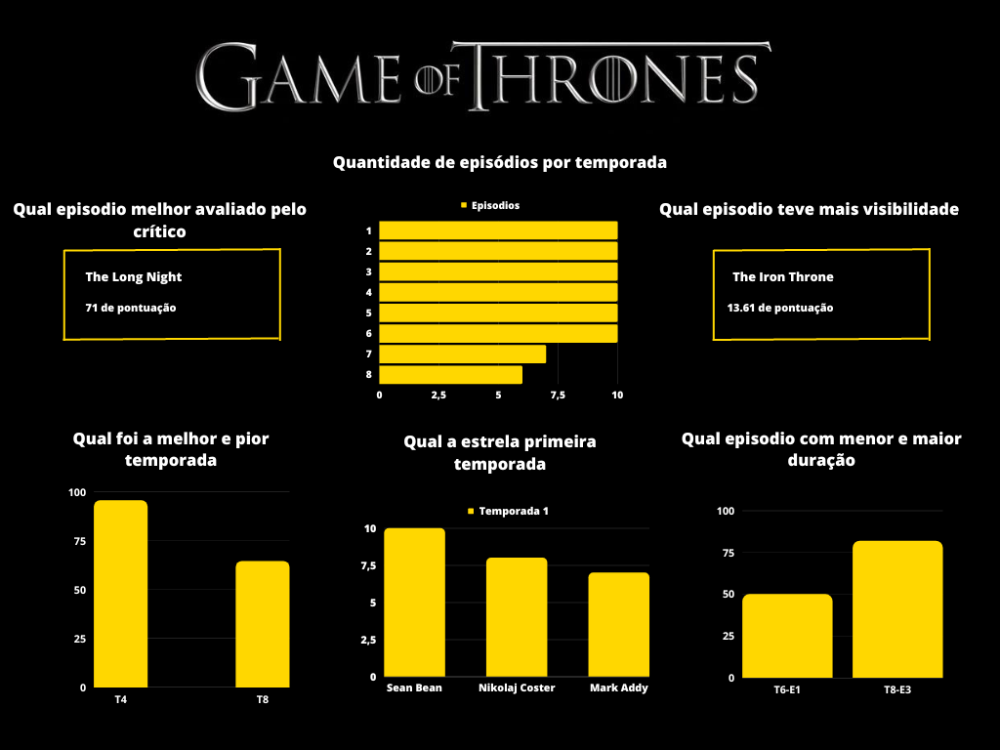

# PROJETO EM GRUPO MÓDULO 4
 
⇨ GRUPO 4 
- Gustavo Resende
- Isadora Grigório
- Letícia Costa
- Rafaela Guimarães
- Regiane Marinho
- Yuri Rodrigues

CONTEXTO ⇨ Temos um problema e precisaremos da sua ajuda para resolver! Acumulamos alguns conjuntos de dados e não conseguimos ter uma visão padronizada desses dados. O conjunto de dados disponíveis podem ser encontrados aqui:https://drive.google.com/drive/folders/1F9Rwbzzz4LJCxZU-mTR4JqDT_2vJ7-sC?usp=sharing.

⇨ Nesse projeto você e sua squad deverão montar um dashboard com base no conjunto de dados escolhidos por vocês, a fim de realizar uma apresentação com a exploração dos dados.

A partir dos dados fornecidos optamos por utilizar a tabela GOT_episodes_v4.cvs que apresenta dados sobre os episódios e temporadas da série Game of Thrones. Durante o Brainstorm sobre perguntas que podem ser respondidas pelos dados selecionamos as seguintes perguntas:

- PERGUNTAS!

⇨ Quais personagens estrelaram na temporada 1?
> Eddard "Ned" Stark (ator: Sean Bean)
> Nicolaj Coster 
> Mark Addy    
> 	SELECT Season AS Temporada, 
    Episode AS Episodios, 
    Title AS Titulo, 
    Star_1 AS Ator_Atriz, 
    Star_2 AS Ator_Atriz, 
    Star_3 AS Ator_Atriz
	FROM episodios
    WHERE Season = 1;

⇨ Qual episódio com a maior avaliação dos critico?
> 1° lugar ( The Long Night ), temporada 8 - episódio 3 - pontuação 7,1    
> 	SELECT Season AS Temporada, 
	Episode AS Episódio, 
	Title AS Título, 
	Critics_reviews AS Avaliação
    FROM episodios
    WHERE Critics_reviews = (SELECT MAX(Critics_reviews) FROM episodios);

⇨ Qual a quantidade de episódios por temporadas?
> Temporada 1 - 10 episódios.   
> Temporada 2 - 10 episódios.   
> Temporada 3 - 10 episódios.   
> Temporada 4 - 10 episódios.   
> Temporada 5 - 10 episódios.   
> Temporada 6 - 10 episódios.   
> Temporada 7 - 07 episódios.   
> Temporada 8 - 06 episódios.    
> 	SELECT DISTINCT Season AS Tempora, COUNT(Episode) AS Quantidades_de_episódios FROM episodios GROUP BY Season;

⇨ Qual foi a melhor temporada e a pior?
> A melhor foi a temporada 4 nota 95,5.
> A pior foi a temporada 8 nota 64,5.   
 	SELECT Season AS Temporada, 
	Episode AS Episódio, 
	Title AS Título, 
	Rating AS Avaliação
    FROM episodios
    WHERE Rating = (SELECT MAX(Rating) FROM episodios);
    
>	SELECT Season AS Temporada, 
	Episode AS Episódio, 
	Title AS Título, 
	Rating AS Avaliação
    FROM episodios
    WHERE Rating = (SELECT MIN(Rating) FROM episodios);

⇨ Qual episodio tem mais visibilidade?
> "The Iron Throne" 13.1 de pontuação.    
> SELECT Season AS Temporada,
    Episode AS Episódio,
    Title AS Título,
    Views AS Visualizações
    FROM episodios
    WHERE Views = (SELECT MAX(Views) FROM episodios);

⇨ Qual episódios com maior duração?
> 8° temporada -  episódio 3 , duração 1h e 22min    
> SELECT Season AS Temporada, 
    Episode AS Episódio, 
    Title AS Título, 
    Duration as Duração 
    FROM episodios 
    WHERE Duration = (SELECT MAX(Duration) FROM episodios);

- DASHBOARD     
⇨ 

